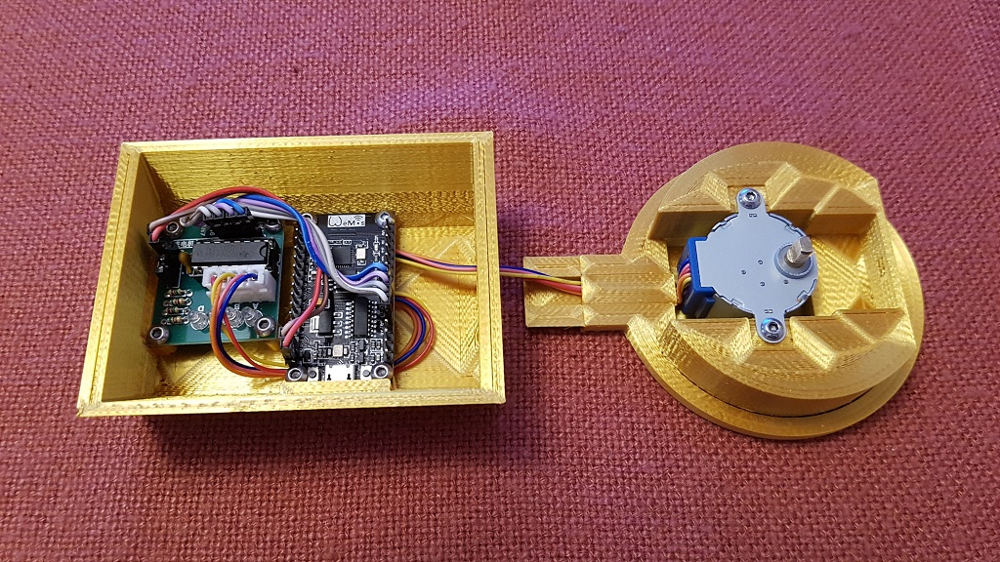

# MinimalClock
## An analog clock out of only 8 printed parts controlled from internet-time via ESP8266 
https://github.com/xSnowHeadx/MinimalClock

README file  
SnowHead Aug 2021  

## Introduction
Shiura on [thingiverse](https://www.thingiverse.com/thing:4931539) designed an extremely simple but fascinating cylindric clock consisting out of only eight printed parts, a stepper motor and two PCB. 
The original is controlled by an ESP32. The firmware here was adapted to an ESP8266 and for the use of the [WTA-timeservice](http://worldtimeapi.org) instead of NTP. So there normally are no firmware-modifications necessary to adapt the timezone and DST because they will be investigated out of the public IP of the request. For special cases (f.e. the use of a foreign proxy server) the timezone can be selected manually by replacing "ip" with the wished [timezone](http://worldtimeapi.org/timezone) in WTAClient.cpp. 

## Used libraries:
- ArduinoJson 
- DNSServer 
- DoubleResetDetector 
- ESP8266HTTPClient 
- ESP8266WebServer 
- ESP8266WiFi 
- WiFiManager  

## Switches in digit.h
<table>
<body>
<tr>
<td>EIGHT_DIGIT</td><td>true if you use a clock with 8 cylinders</td>
</tr><tr> 
<td>ORIGIN_SENSOR</td><td>true if origin sensor is installed</td>
</tr><tr> 
<td>ORIGIN_COMPENSATION</td><td>(default 50) compensation of origin mark position</td>
</tr><tr> 
<td>ORIGIN_BRIGHTMARK</td><td>true if origin mark is brighter than background</td>
</tr><tr> 
<td>ORIGIN_THRES</td><td>(default 3500) photo reflector sensor ADC threshold</td>
</tr><tr> 
<td>PRE_MOVE</td><td>true to start cylinder movement earlier to reach the target position just in time</td>
</tr><tr> 
<td>DEBUG</td><td>true for additional debug messages on serial console</td>
</tr> 
</body></table>
Some modified mechanic parts are described [here](https://thingiverse.com/thing:4941138) 
See informations to ESP32-based original version [here](https://www.thingiverse.com/thing:4931539). 
